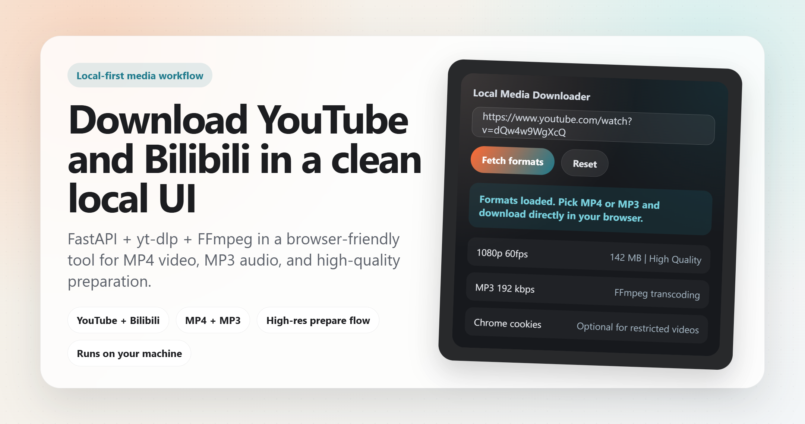
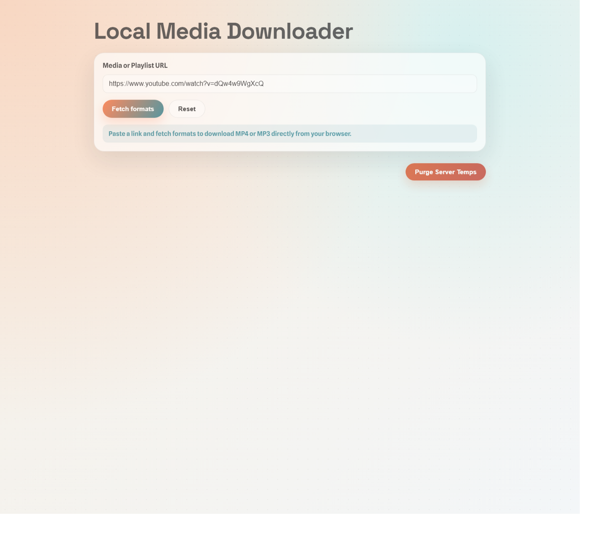
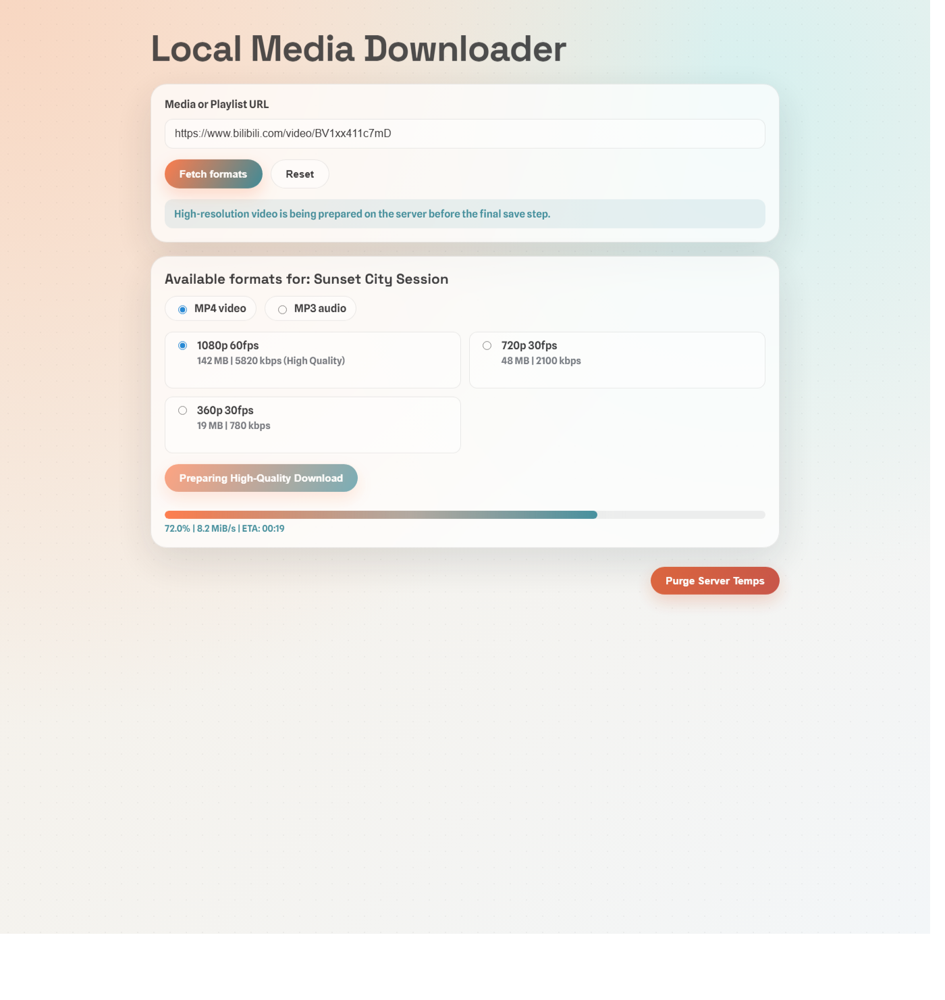

# Local Media Downloader

语言：简体中文 | [English](README.md)

这是一款本地媒体下载工具，适用于 yt-dlp 兼容的媒体链接。粘贴链接后即可获取可用格式，并直接在浏览器中下载单个视频，或将整个播放列表保存为 MP4 或 MP3。

<p align="center">
  
</p>

## 为什么做这个项目

- 完全在你的电脑本地运行，不依赖第三方下载网站。
- 用一个简洁的浏览器界面统一处理多个视频平台链接。
- 支持 MP4 下载、MP3 转码、播放列表 ZIP 打包，以及需要合并音视频时的高质量准备流程。
- 会显示准备进度，方便查看大文件或播放列表当前处理到哪里。
- 技术栈直接且容易理解，核心依赖只有 FastAPI、yt-dlp 和 FFmpeg。

## 功能亮点

- 简洁的本地浏览器下载流程
- 支持 MP4 视频和 MP3 音频下载
- 支持将播放列表下载并打包为 ZIP
- 双列展示分辨率、码率、体积等格式信息
- 支持需要合并音视频时的高分辨率准备流程
- 可选导入 Chrome cookies 处理受限内容
- 内置服务器临时文件清理功能

## 最新截图

<p align="center">
  
</p>

<p align="center">
  <em>首页界面，包含链接输入框、格式获取操作，以及单视频或播放列表下载入口。</em>
</p>

<p align="center">
  
</p>

<p align="center">
  <em>单视频下载流程，包含格式选择、准备进度，以及最终保存步骤。</em>
</p>

## 使用的开源项目

- [FastAPI](https://github.com/fastapi/fastapi)：本地 Web 应用与 API。
- [Uvicorn](https://github.com/encode/uvicorn)：ASGI 服务运行环境。
- [yt-dlp](https://github.com/yt-dlp/yt-dlp)：提取视频和音频格式并处理下载。
- [FFmpeg](https://ffmpeg.org/)：媒体处理与 MP3 转码。
- [python-multipart](https://github.com/Kludex/python-multipart)：处理 FastAPI 表单数据。

## 环境要求

- Python 3.10+
- 已安装 FFmpeg，并加入 `PATH`

## 安装步骤（PowerShell）

```powershell
python -m venv .venv
.\.venv\Scripts\Activate.ps1
pip install -r requirements.txt
```

## 运行

```powershell
python main.py
```

然后在浏览器中打开 `http://127.0.0.1:8000`。

## 说明

- 单视频 MP4 选项会列出包含视频和音频、可直接下载的格式。
- 播放列表下载会在后台处理完成后打包成 ZIP。
- MP3 下载会通过 FFmpeg 按所选码率转码。
- 后端通常也兼容更多 yt-dlp 支持的站点，即使当前 UI 没有逐一列出。
- 如果 YouTube 出现 “confirm you're not a bot” 错误，请启用 “Use Chrome cookies”。Chrome 必须先关闭，也可以启用 “Auto-close Chrome”。
- 仅下载你拥有版权或已获得授权的内容。
